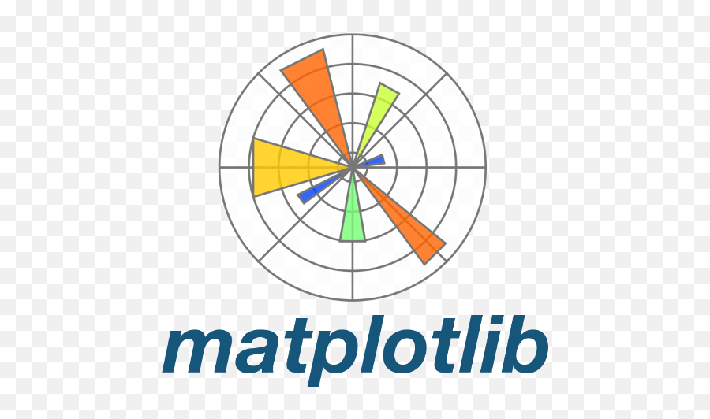

# My Professional Journey

Hi there 👋

Welcome to my professional journey overview! This repository showcases my internships, certifications, and skills as outlined.

---

### CERTIFICATIONS

 &nbsp; &nbsp; &nbsp; &nbsp;   &nbsp;  &nbsp;  &nbsp;  &nbsp; &nbsp;
 &nbsp; &nbsp; &nbsp; &nbsp; &nbsp; &nbsp; &nbsp; &nbsp; &nbsp; &nbsp;  &nbsp; &nbsp; &nbsp; &nbsp; &nbsp; &nbsp; &nbsp; &nbsp; &nbsp;  &nbsp; &nbsp; &nbsp; &nbsp; &nbsp; &nbsp; &nbsp; &nbsp; &nbsp; &nbsp; 
 
&nbsp; **[Google](https://www.coursera.org/account/accomplishments/verify/VGD6QIR9X5V6)** &nbsp; &nbsp; &nbsp; &nbsp; &nbsp; &nbsp; &nbsp; &nbsp; &nbsp; &nbsp; &nbsp;&nbsp; **[Microsoft](https://github.com/sreena-dev/sreena-dev/blob/ed5f6033353a9fd881afc533a733c5470067c651/assets/SREENA%20%20M_certificate.pdf)** &nbsp; &nbsp; &nbsp; &nbsp; &nbsp; &nbsp; &nbsp; &nbsp; &nbsp; &nbsp; &nbsp; &nbsp; **[IBM](https://www.coursera.org/account/accomplishments/verify/YNNC8P29WAMF)** &nbsp; &nbsp; &nbsp; &nbsp; &nbsp; &nbsp; &nbsp; &nbsp; &nbsp; &nbsp; &nbsp; &nbsp; &nbsp;**[LinkedIn Learning](https://github.com/sreena-dev/sreena-dev/blob/171b2d5e2582d2b5b0ce25e07f1e84019f4bb860/assets/CertificateOfCompletion_Artificial%20Intelligence%20Foundations%20Thinking%20Machines.pdf)** &nbsp; &nbsp; &nbsp; &nbsp; **[DeepLearning.AI](https://www.coursera.org/account/accomplishments/verify/BR37VQ3GAUES?utm_source=link&utm_medium=certificate&utm_content=cert_image&utm_campaign=sharing_cta&utm_product=course)**

 

### SKILLS

 &nbsp; &nbsp; &nbsp; &nbsp;   &nbsp;  &nbsp;  &nbsp;  &nbsp; &nbsp;
 &nbsp; &nbsp; &nbsp; &nbsp; &nbsp; &nbsp; &nbsp; &nbsp; &nbsp; &nbsp;
 
&nbsp; **Python** &nbsp; &nbsp; &nbsp; &nbsp; &nbsp; &nbsp; &nbsp; &nbsp; &nbsp; &nbsp; &nbsp;&nbsp; **Java** 

 

### DATABASE

 &nbsp; &nbsp; &nbsp; &nbsp; &nbsp;  &nbsp; &nbsp;
 

 
 

 &nbsp; &nbsp; &nbsp; &nbsp;   &nbsp;  &nbsp;  &nbsp;  &nbsp; &nbsp;
 &nbsp; &nbsp; &nbsp; &nbsp; &nbsp; &nbsp; &nbsp; &nbsp; &nbsp; &nbsp;  &nbsp; &nbsp; &nbsp; &nbsp; &nbsp; &nbsp; &nbsp; &nbsp; &nbsp;  &nbsp; &nbsp; &nbsp; &nbsp; &nbsp; &nbsp; &nbsp; &nbsp; &nbsp; &nbsp; 
 

* **Programming Languages:** [Python, Java]
* **Frameworks & Libraries:** [TensorFlow, PyTorch, Flask]
* **Tools & Technologies:** [e.g., Git, Docker, AWS, Azure, Google Cloud Platform, Tableau]
* **Databases:** [SQL (MySQL, PostgreSQL)]
* **Concepts & Areas:** [Data Analysis, Machine Learning, Deep Learning, Cloud Computing]

  

---
