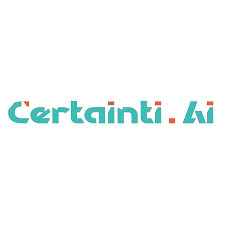

# My Professional Journey

Hi there 👋

Welcome to my professional journey overview! This repository showcases my internships, certifications, and skills as outlined.

---

### INTERNSHIP

&nbsp; **CERTAINTI.AI** &nbsp; &nbsp; &nbsp; &nbsp; &nbsp; &nbsp; &nbsp; &nbsp; &nbsp; &nbsp; &nbsp; &nbsp; &nbsp; &nbsp; &nbsp; &nbsp; &nbsp; &nbsp; &nbsp; &nbsp;&nbsp;&nbsp;&nbsp;&nbsp;&nbsp;&nbsp;&nbsp;&nbsp;&nbsp;&nbsp;&nbsp;&nbsp;&nbsp;&nbsp;&nbsp;&nbsp; &nbsp;**MICROSOFT GGR edunet** 

 &nbsp; &nbsp; &nbsp; &nbsp; &nbsp; &nbsp; &nbsp;  &nbsp; &nbsp; &nbsp; &nbsp; &nbsp; &nbsp; &nbsp; &nbsp; &nbsp; &nbsp; &nbsp;  

### CERTIFICATIONS

 &nbsp; &nbsp; &nbsp; &nbsp; &nbsp; &nbsp; &nbsp; &nbsp; &nbsp; &nbsp;  &nbsp; &nbsp; &nbsp; &nbsp; &nbsp; &nbsp; &nbsp; &nbsp; &nbsp; &nbsp;  &nbsp; &nbsp; &nbsp; &nbsp; &nbsp; &nbsp; &nbsp; &nbsp; &nbsp; &nbsp;  &nbsp; &nbsp; &nbsp; &nbsp; &nbsp; &nbsp; &nbsp; &nbsp; &nbsp; &nbsp; 
 
&nbsp; **Google** &nbsp; &nbsp; &nbsp; &nbsp; &nbsp; &nbsp; &nbsp; &nbsp; &nbsp; &nbsp; &nbsp; **Microsoft** &nbsp; &nbsp; &nbsp; &nbsp; &nbsp; &nbsp; &nbsp; &nbsp; &nbsp; &nbsp; &nbsp; &nbsp; **IBM** &nbsp; &nbsp; &nbsp; &nbsp; &nbsp; &nbsp; &nbsp; &nbsp; &nbsp; &nbsp; **LinkedIn Learning** &nbsp; &nbsp; &nbsp; &nbsp; **DeepLearning.AI**
 

  

### SKILLS

**PROF**

* **Programming Languages:** [e.g., Python, Java, C++, JavaScript, R]
* **Frameworks & Libraries:** [e.g., TensorFlow, PyTorch, React, Node.js, Django, Flask, Spring Boot]
* **Tools & Technologies:** [e.g., Git, Docker, Kubernetes, AWS, Azure, Google Cloud Platform, Tableau]
* **Databases:** [e.g., SQL (MySQL, PostgreSQL), NoSQL (MongoDB, Cassandra)]
* **Concepts & Areas:** [e.g., Data Analysis, Machine Learning, Deep Learning, Web Development, Cloud Computing, UI/UX Design]
* **Soft Skills:** [e.g., Problem-Solving, Teamwork, Communication, Project Management, Adaptability]

  

---

### 📬 Connect with Me

Feel free to connect with me for collaborations, discussions, or opportunities!

* **LinkedIn:** [Your LinkedIn Profile URL]
* **GitHub:** [Your GitHub Profile URL]
* **Email:** [Your Email Address]
